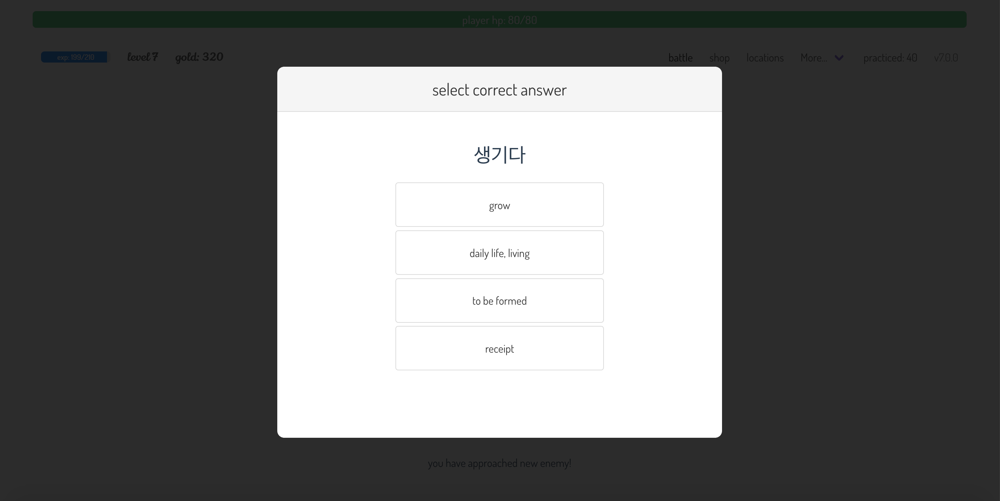

# language learning rpg

learn a language by playing rpg game!

# how to play

- select correct answer to attack or dodge attack
- if you select wrong answer, your attack miss / enemy hits you
- collect gold and buy stronger items in shop
- level up and go to different locations

# screenshots




## project setup

```
npm install
```

### compiles and hot-reloads for development

```
npm run serve
```

### compiles and minifies for production

```
npm run build
```

### run your tests

```
npm run test
```

### lints and fixes files

```
npm run lint
```

### customize configuration

See [Configuration Reference](https://cli.vuejs.org/config/).
