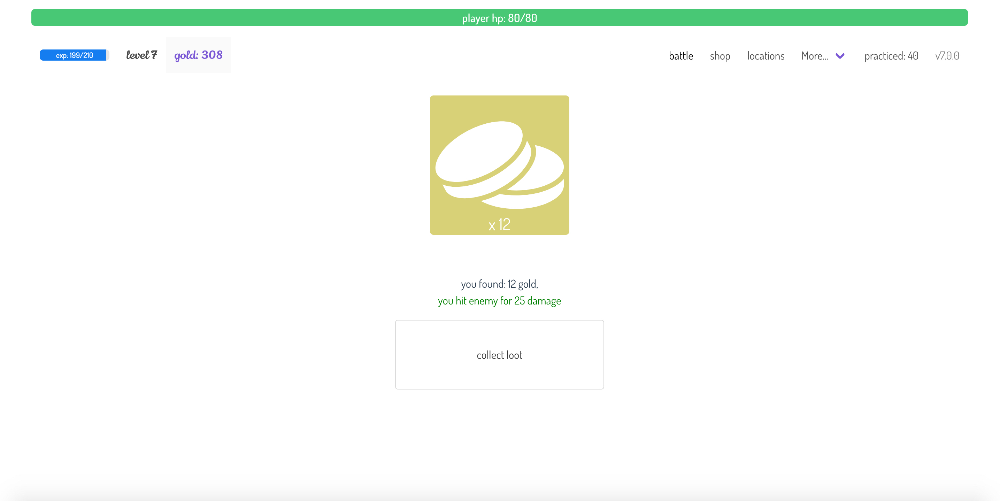

# language learning rpg

learn a language by playing rpg game!

to play the game just go here:

https://jaroslaw-weber.github.io/language-learning-rpg/

now also available on mobile!

# how to play

- choose what do you want to learn
- click attack, then select correct answer
- if you select wrong answer, your attack miss
- collect gold and buy stronger items in shop
- remember to buy potions when low on hp!
- level up and go to different locations

# screenshots





## project setup

```
npm install
```

### compiles and hot-reloads for development

```
npm run serve
```

### customize configuration

See [Configuration Reference](https://cli.vuejs.org/config/).
